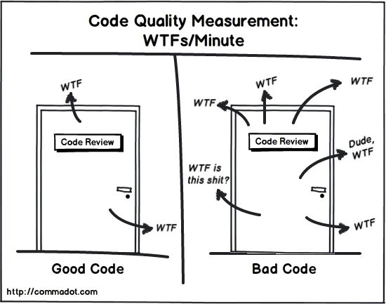
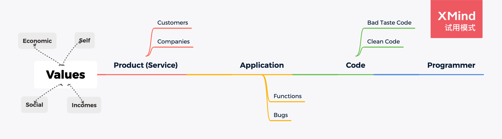

title: 整洁代码
speaker: 苑朋飞
prismTheme: solarizedlight

<slide class="bg-black-blue aligncenter" image="https://source.unsplash.com/C1HhAQrbykQ/">

# 整洁代码 {.text-landing.text-shadow}

By 苑朋飞 {.text-intro}

<slide class="bg-blue aligncenter">

## 引言
----
<slide class="bg-blue aligncenter">

<slide class="bg-blue aligncenter">

<slide class="bg-blue aligncenter">

## 为什么分享这个主题 {.text-landing.text-shadow}
----

<slide class="bg-blue aligncenter">

- **老生常谈 却很难做到** {.lightSpeedIn}
- **众说纷纭 无统一标准** {.lightSpeedIn}
- **自以为是 另类别致** {.lightSpeedIn}
  {.build}

<slide class="bg-blue aligncenter">

## 大佬怎么说？
----

<slide class="fullscreen">

:::card

---

## Bjarne   Stroustrup  《C++程序设计语言》C++语言发明者

我喜欢优雅和高效的代码，代码逻辑应当直接了当，叫缺陷难以隐藏；尽量减少依赖关系，使之便于维护；依据某种分层战略完善错误处理代码；性能调至最优，省得引诱别人做没规矩的优化，搞出一堆混乱来。整洁的代码只做好一件事。

:::
<slide class="fullscreen">

:::card

---

## Grady Booch   《面向对象分析与设计》

整洁的代码简单直接。整洁的代码如同优美的散文。整洁的代码从不隐藏设计者的意图，充满了干净利落的抽象和直截了当的控制语句。							

:::
<slide class="fullscreen">

:::card

---

##  Dave Thomas   OTI 公司创始人   Eclipse战略教父

整洁的代码应可由作者之外的开发者阅读和增补。它应当有单元测试和验收测试。它使用有意义的命名。它只提供一种而非多种做一件事的途径。它只有尽量少的依赖关系，且要明确的定义和提供清晰、尽量少的API。代码应通过其字面表达含义，因为不同的语言导致并非所有必需信息均可通过代码自身清晰表达。							

:::
<slide class="fullscreen">

:::card

##  Michael Feathers   《修改代码的艺术》

我可以列出我留意到的整洁代码的所有特点，但其中有一条是根本性的。整洁代码总是看起来像是某位特别在意它的人写的。几乎没有改进的余地。代码作者什么都想到了，如果你企图改进它，总会回到原点，赞叹某人留给你的代码——全身心投入的某人留下的代码。

---

						

:::
<slide class="fullscreen">

:::card

##  Ron Jeffries    《极限编程实施》《C#极限编程探险》

消除重复和提高表达力让我在整洁代码方面获益良多，只要铭记这两点，改进脏代码时就会有大不同。
减少重复代码，提高表达力，提早构建简单的抽象。这就是我写整洁代码的方法。

---

						

:::
<slide class="fullscreen">

:::card

##   Ward Cunningham   SmallTalk语言和面向对象思想领袖

如果每个例程都让你感到深合己意，那就是整洁代码。如果代码让编程语言看起来像是专门解决那个问题而存在的，他就可以称得上漂亮的代码。

---

						

:::

<slide class="bg-blue aligncenter">

## 非整洁 Vs 整洁  {.text-landing.text-shadow}
----

<slide class="bg-blue aligncenter">

### 非整洁代码

- 乱（组织乱，职责乱，名称乱起）{.lightSpeedIn}
- 逻辑不清晰（if-else 嵌套太多）{.lightSpeedIn}
- 绕弯子（简单的事写的很复杂）{.lightSpeedIn}
- 看不懂（只有写的人能理解）{.lightSpeedIn}
- 难修改（耦合严重，各种写死）{.lightSpeedIn}
{.build}
:::

<slide class="bg-blue aligncenter">

### 整洁代码

- 清晰（是什么，做了什么，一眼看得出来）{.lightSpeedIn}
- 简单（职责少，代码少，逻辑少）{.lightSpeedIn}
- 干净（没有冗余的逻辑）{.lightSpeedIn}
- 好拓展（依赖的比较少，修改不会影响很多）{.lightSpeedIn}
{.build}

<slide class="bg-blue aligncenter">

## 如何写整洁代码
----

<slide class="bg-blue aligncenter">

### 涵盖的方面

- 命名 {.lightSpeedIn}
- 注释 {.lightSpeedIn}
- 函数（封装）{.lightSpeedIn}
- 参数 {.lightSpeedIn}
- 排版 {.lightSpeedIn}
{.build}

<slide class="bg-blue aligncenter">

### 思想上 && 行为上
----

<slide class="bg-blue aligncenter">

#### 思想上 {.lightSpeedIn}

- 自我要求 {.lightSpeedIn}
- 养成习惯 {.lightSpeedIn}
{.build}

<slide class="bg-blue aligncenter">

#### 行为上 {.lightSpeedIn}

- 定期自我 review + refactor {.lightSpeedIn}
- code review + refactor {.lightSpeedIn}

{.build}

<slide class="bg-blue aligncenter">

## 针对 React
----

<slide class="bg-blue aligncenter">

### 组件的封装

- 按模块 {.lightSpeedIn}
- 粒度适中 {.lightSpeedIn}
- 高内聚 {.lightSpeedIn}
- 低耦合 {.lightSpeedIn}
- 可复用 {.lightSpeedIn}
{.build}

<slide class="bg-blue aligncenter">

### 业务逻辑处理

- 依赖清晰 {.lightSpeedIn}
- 函数封装细节 {.lightSpeedIn}
- error 及边界情况处理 {.lightSpeedIn}
{.build}

<slide class="bg-blue aligncenter" >

## 书籍推荐
----

<slide class="aligncenter bg-blue">

:::gallery

## 代码整洁之道

Robert C. Martin

---

## 重构

Martin Fowler

---

## 编写可读代码的艺术

Dustin Boswell 

---

## Javascript设计模式开发实践

曾探
:::

<slide class="bg-blue aligncenter" >

## 链接分享
----

[clean-code-javascript](https://github.com/ryanmcdermott/clean-code-javascript)

<slide class="bg-blue aligncenter" >

# Thanks